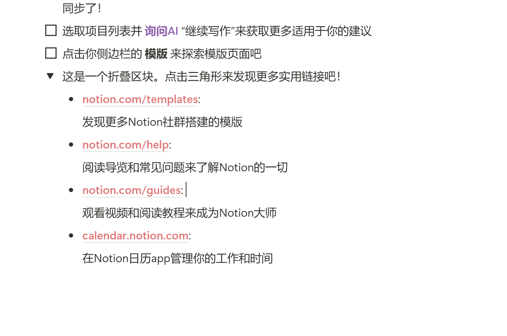

# 从电脑桌面端开始吧！

👋 欢迎来到 Notion ！

这些是帮助你熟悉 Notion 的基础步骤：

- [ ]  点击任何地方来开始工作
- [ ]  输入 / 来查看你能创建的所有内容类型：标题，视频，子页面，等等…
- [ ]  选中任何文字，然后使用弹出菜单栏来`随心` **变换** *你的* ~~写作~~ 格式
- [ ]  尝试将鼠标悬停在本行，看到待办事项方框左侧的 **⋮⋮** 了吗？长按以移动本行内容
- [ ]  点击你侧边栏顶部的 **+ 新页面** 来添加页面
- [ ]  点击侧边栏中的 **日历** 来同步管理你的工作和时间。Notion日历app可以和你的Google日历整合同步了！
- [ ]  选取项目列表并 **询问AI** “继续写作”来获取更多适用于你的建议
- [ ]  点击你侧边栏的 **模版** 来探索模版页面吧
- 这是一个折叠区块。点击三角形来发现更多实用链接吧！
    - [**notion.com/templates**](https://www.notion.so/templates):
        
        发现更多Notion社群搭建的模版
        
    - [**notion.com/help**](https://www.notion.so/help): ****
        
        阅读导览和常见问题来了解Notion的一切
        
    - [**notion.com/guides**](http://notion.com/guides):
        
        观看视频和阅读教程来成为Notion大师
        
    - [**calendar.notion.com**](http://calendar.notion.so):
        
        在Notion日历app管理你的工作和时间
        

